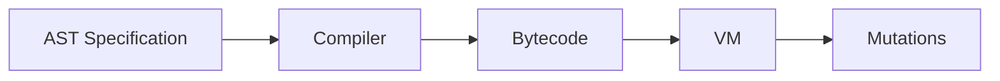

The HyperStack interpreter transforms blockchain events into entity mutations through a three-stage pipeline: AST compilation, bytecode generation, and VM execution.

## Pipeline Overview



1. **AST** - Abstract Syntax Tree defines transformations
2. **Compiler** - Converts AST to bytecode
3. **Bytecode** - Low-level instructions
4. **VM** - Executes bytecode to produce mutations

## Abstract Syntax Tree (AST)

The AST is a declarative specification of how blockchain data maps to entities.

**Location**: `interpreter/src/ast.rs`

### SerializableStreamSpec

```rust
pub struct SerializableStreamSpec {
    pub state_name: String,
    pub program_id: Option<String>,
    pub idl: Option<IdlSnapshot>,
    pub identity: IdentitySpec,
    pub handlers: Vec<SerializableHandlerSpec>,
    pub sections: Vec<EntitySection>,
    pub field_mappings: BTreeMap<String, FieldTypeInfo>,
    pub resolver_hooks: Vec<ResolverHook>,
    pub instruction_hooks: Vec<InstructionHook>,
    pub resolver_specs: Vec<ResolverSpec>,
    pub computed_fields: Vec<String>,
    pub computed_field_specs: Vec<ComputedFieldSpec>,
    pub content_hash: Option<String>,
    pub views: Vec<ViewDef>,
}
```

### Handler Specification

```rust
pub struct TypedHandlerSpec<S> {
    pub source: SourceSpec,              // Event source
    pub key_resolution: KeyResolutionStrategy, // How to get primary key
    pub mappings: Vec<TypedFieldMapping<S>>,  // Field transformations
    pub conditions: Vec<Condition>,      // Filter conditions
    pub emit: bool,                      // Whether to emit mutation
}
```

### Key Resolution Strategies

```rust
pub enum KeyResolutionStrategy {
    // Extract key from event field
    Embedded { 
        primary_field: FieldPath 
    },
    
    // Look up key in index
    Lookup { 
        primary_field: FieldPath 
    },
    
    // Compute key from multiple fields
    Computed { 
        primary_field: FieldPath,
        compute_partition: ComputeFunction,
    },
    
    // Temporal lookup (time-series data)
    TemporalLookup {
        lookup_field: FieldPath,
        timestamp_field: FieldPath,
        index_name: String,
    },
}
```

### Field Mappings

```rust
pub struct TypedFieldMapping<S> {
    pub target_path: String,           // Entity field path
    pub source: MappingSource,         // Where data comes from
    pub transform: Option<Transformation>, // Optional transformation
    pub population: PopulationStrategy,   // How to update field
    pub condition: Option<ConditionExpr>, // Optional condition
    pub when: Option<String>,          // Defer until instruction
    pub stop: Option<String>,          // Stop on instruction
    pub emit: bool,                    // Include in mutation
}
```

### Population Strategies

```rust
pub enum PopulationStrategy {
    SetOnce,      // Set field only if null
    LastWrite,    // Always overwrite
    Append,       // Append to array
    Merge,        // Merge objects
    Max,          // Take maximum value
    Sum,          // Accumulate sum
    Count,        // Increment counter
    Min,          // Take minimum value
    UniqueCount,  // Count unique values
}
```

### Transformations

```rust
pub enum Transformation {
    HexEncode,    // [1,2,3] → "010203"
    HexDecode,    // "010203" → [1,2,3]
    Base58Encode, // [1,2,3] → "Uakgb"
    Base58Decode, // "Uakgb" → [1,2,3]
    ToString,     // 123 → "123"
    ToNumber,     // "123" → 123
}
```

## Compiler

The compiler converts AST specifications into bytecode.

**Location**: `interpreter/src/compiler.rs`

### TypedCompiler

```rust
pub struct TypedCompiler<S> {
    pub spec: TypedStreamSpec<S>,
    entity_name: String,
    state_id: u32,
}

impl<S> TypedCompiler<S> {
    pub fn compile(&self) -> MultiEntityBytecode {
        let entity_bytecode = self.compile_entity();
        // ... build routing tables
    }
    
    fn compile_entity(&self) -> EntityBytecode {
        let mut handlers = HashMap::new();
        
        for handler_spec in &self.spec.handlers {
            let opcodes = self.compile_handler(handler_spec);
            let event_type = self.get_event_type(&handler_spec.source);
            handlers.insert(event_type, opcodes);
        }
        
        EntityBytecode { handlers, ... }
    }
}
```

### Handler Compilation

```rust
fn compile_handler(&self, spec: &TypedHandlerSpec<S>) -> Vec<OpCode> {
    let mut ops = Vec::new();
    
    // 1. Load primary key
    ops.extend(self.compile_key_loading(&spec.key_resolution, ...));
    
    // 2. Read or initialize state
    ops.push(OpCode::ReadOrInitState {
        state_id: self.state_id,
        key: key_reg,
        default: json!({}),
        dest: state_reg,
    });
    
    // 3. Process field mappings
    for mapping in &spec.mappings {
        ops.extend(self.compile_mapping(mapping, ...));
    }
    
    // 4. Evaluate computed fields
    ops.push(OpCode::EvaluateComputedFields {
        state: state_reg,
        computed_paths: self.spec.computed_fields.clone(),
    });
    
    // 5. Update state table
    ops.push(OpCode::UpdateState {
        state_id: self.state_id,
        key: key_reg,
        value: state_reg,
    });
    
    // 6. Emit mutation
    if spec.emit {
        ops.push(OpCode::EmitMutation {
            entity_name: self.entity_name.clone(),
            key: key_reg,
            state: state_reg,
        });
    }
    
    ops
}
```

## Bytecode

Bytecode consists of low-level operations executed by the VM.

**Location**: `compiler.rs:13-218`

### OpCode Types

**Loading**:
```rust
LoadEventField {      // Load field from event
    path: FieldPath,
    dest: Register,
    default: Option<Value>,
}

LoadConstant {        // Load constant value
    value: Value,
    dest: Register,
}
```

**State Operations**:
```rust
ReadOrInitState {     // Load entity from state table
    state_id: u32,
    key: Register,
    default: Value,
    dest: Register,
}

UpdateState {         // Save entity to state table
    state_id: u32,
    key: Register,
    value: Register,
}
```

**Field Operations**:
```rust
SetField {            // Set field value
    object: Register,
    path: String,
    value: Register,
}

AppendToArray {       // Append to array field
    object: Register,
    path: String,
    value: Register,
}

SetFieldSum {         // Add to accumulator
    object: Register,
    path: String,
    value: Register,
}

SetFieldIncrement {   // Increment counter
    object: Register,
    path: String,
}
```

**Conditional Operations**:
```rust
ConditionalSetField { // Set if condition true
    object: Register,
    path: String,
    value: Register,
    condition_field: FieldPath,
    condition_op: ComparisonOp,
    condition_value: Value,
}

SetFieldWhen {        // Defer until instruction
    object: Register,
    path: String,
    value: Register,
    when_instruction: String,
    entity_name: String,
    key_reg: Register,
}
```

**Index Operations**:
```rust
UpdateLookupIndex {   // Register in lookup index
    state_id: u32,
    index_name: String,
    lookup_value: Register,
    primary_key: Register,
}

LookupIndex {         // Query lookup index
    state_id: u32,
    index_name: String,
    lookup_value: Register,
    dest: Register,
}
```

**Transformation**:
```rust
Transform {           // Apply transformation
    source: Register,
    dest: Register,
    transformation: Transformation,
}
```

**Emission**:
```rust
EmitMutation {        // Queue mutation for projector
    entity_name: String,
    key: Register,
    state: Register,
}
```

### MultiEntityBytecode

```rust
pub struct MultiEntityBytecode {
    pub entities: HashMap<String, EntityBytecode>,
    pub event_routing: HashMap<String, Vec<String>>,
    pub when_events: HashSet<String>,
    pub proto_router: ProtoRouter,
}

pub struct EntityBytecode {
    pub state_id: u32,
    pub handlers: HashMap<String, Vec<OpCode>>,
    pub entity_name: String,
    pub when_events: HashSet<String>,
    pub non_emitted_fields: HashSet<String>,
    pub computed_paths: Vec<String>,
    pub computed_fields_evaluator: Option<ComputedFieldsEvaluator>,
}
```

## Bytecode Example

For a simple handler:

```rust
// Handler: TransferIxState → Token entity
// Maps: accounts.from → from_address (HexEncode)
//       accounts.to → to_address (HexEncode)
//       amount → amount
```

Generated bytecode:

```rust
vec![
    // Load key from accounts.mint
    LoadEventField { path: ["accounts", "mint"], dest: 18, default: None },
    Transform { source: 18, dest: 23, transformation: HexEncode },
    CopyRegister { source: 23, dest: 20 },
    
    // Read or init state
    ReadOrInitState { state_id: 0, key: 20, default: {}, dest: 2 },
    
    // Map from_address
    LoadEventField { path: ["accounts", "from"], dest: 10, default: None },
    Transform { source: 10, dest: 10, transformation: HexEncode },
    SetField { object: 2, path: "from_address", value: 10 },
    
    // Map to_address
    LoadEventField { path: ["accounts", "to"], dest: 10, default: None },
    Transform { source: 10, dest: 10, transformation: HexEncode },
    SetField { object: 2, path: "to_address", value: 10 },
    
    // Map amount
    LoadEventField { path: ["amount"], dest: 10, default: None },
    SetField { object: 2, path: "amount", value: 10 },
    
    // Update state
    UpdateState { state_id: 0, key: 20, value: 2 },
    
    // Emit mutation
    EmitMutation { entity_name: "Token", key: 20, state: 2 },
]
```

## Computed Fields

Computed fields are evaluated via external hooks.

### ComputedExpr AST

```rust
pub enum ComputedExpr {
    FieldRef { path: String },
    UnwrapOr { expr: Box<ComputedExpr>, default: Value },
    Binary { op: BinaryOp, left: Box<ComputedExpr>, right: Box<ComputedExpr> },
    Cast { expr: Box<ComputedExpr>, to_type: String },
    MethodCall { expr: Box<ComputedExpr>, method: String, args: Vec<ComputedExpr> },
    Literal { value: Value },
    // ... more variants
}
```

### Evaluator Hook

```rust
let evaluator = |state: &mut Value, slot: Option<u64>, timestamp: i64| -> Result<()> {
    // Example: Calculate total_value = balance * price
    if let Some(obj) = state.as_object_mut() {
        let balance = obj.get("balance")
            .and_then(|v| v.as_f64())
            .unwrap_or(0.0);
        let price = obj.get("price")
            .and_then(|v| v.as_f64())
            .unwrap_or(0.0);
        
        obj.insert("total_value".to_string(), json!(balance * price));
    }
    Ok(())
};

let bytecode = MultiEntityBytecode::new()
    .add_entity_with_evaluator("Token", spec, 0, Some(evaluator))
    .build();
```

## Proto Router

The proto router deserializes protobuf messages into JSON events.

**Location**: `interpreter/src/proto_router.rs`

```rust
pub struct ProtoRouter {
    // Maps discriminator → MessageDescriptor
}

impl ProtoRouter {
    pub fn route(&self, discriminator: &[u8], data: &[u8]) -> Option<Value> {
        // 1. Look up message descriptor
        // 2. Deserialize protobuf data
        // 3. Convert to JSON
    }
}
```

## Performance Optimization

### Path Caching

The VM caches compiled field paths to avoid repeated string splitting:

```rust
fn get_compiled_path(&mut self, path: &str) -> CompiledPath {
    if let Some(compiled) = self.path_cache.get(path) {
        self.cache_hits += 1;
        return compiled.clone();
    }
    let compiled = CompiledPath::new(path);
    self.path_cache.insert(path.to_string(), compiled.clone());
    compiled
}
```

**Benefit**: 10-20% reduction in field access overhead

### Register Allocation

The compiler uses a simple register allocation strategy:

- Registers 0-9: Reserved for system use
- Register 2: State object
- Register 10: Temp register for mappings
- Registers 15-25: Key resolution
- Registers 100+: User-defined

### Dirty Tracking

Only modified fields are included in mutations:

```rust
pub struct DirtyTracker {
    changes: HashMap<String, FieldChange>,
}

pub enum FieldChange {
    Replaced,              // Full field value
    Appended(Vec<Value>),  // Only appended items
}
```

## Next Steps

<CardGroup cols={2}>
  <Card title="Virtual Machine" icon="microchip" href="/server/vm">
    Deep dive into VM execution
  </Card>
  <Card title="Projector" icon="broadcast-tower" href="/server/projector">
    Learn about the projector
  </Card>
  <Card title="Architecture" icon="sitemap" href="/server/architecture">
    Understand the architecture
  </Card>
  <Card title="Configuration" icon="sliders" href="/server/configuration">
    Configure the interpreter
  </Card>
</CardGroup>
