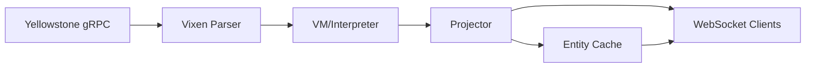

The HyperStack server is a high-performance WebSocket server designed to stream blockchain data transformations to connected clients in real-time. It processes Solana blockchain events, transforms them through a custom VM, and delivers entity updates over WebSocket connections.

## Architecture

The server consists of several key components:

<CardGroup cols={2}>
  <Card title="Interpreter/VM" icon="microchip" href="/server/vm">
    Executes bytecode to transform blockchain data into entities
  </Card>
  <Card title="Projector" icon="broadcast-tower" href="/server/projector">
    Publishes entity mutations to WebSocket clients
  </Card>
  <Card title="WebSocket Server" icon="plug" href="/server/websocket-protocol">
    Manages client connections and subscriptions
  </Card>
  <Card title="Runtime" icon="server" href="/server/deployment">
    Orchestrates all components and manages lifecycle
  </Card>
</CardGroup>

## Key Features

### Real-time Streaming
The server supports three streaming modes:

- **State** - Watch a single entity by key (latest value only)
- **List** - Subscribe to collections of entities
- **Append** - Stream append-only data

### High Performance

- **Bytecode Execution** - Pre-compiled transformations run in a custom VM
- **LRU Caching** - State tables, lookups, and resolvers all use LRU eviction
- **Concurrent Processing** - Built on Tokio async runtime
- **Compression** - Optional gzip compression for large payloads

### Reliability

- **Health Monitoring** - Track stream status and connectivity
- **Automatic Reconnection** - Exponential backoff for gRPC streams
- **Graceful Shutdown** - Handles SIGINT/SIGTERM signals

### Observability

- **Structured Logging** - JSON logs with tracing spans
- **OpenTelemetry** - Optional OTLP metrics and traces (enable `otel` feature)
- **Health Endpoints** - HTTP health checks for liveness/readiness

## Data Flow



1. **Yellowstone gRPC** - Streams blockchain data (accounts, transactions, instructions)
2. **Vixen Parser** - Deserializes protobuf messages into events
3. **VM/Interpreter** - Transforms events into entity mutations via bytecode
4. **Projector** - Routes mutations to appropriate buses and caches
5. **Entity Cache** - Stores current state for snapshot delivery
6. **WebSocket Clients** - Receive real-time updates

## Getting Started

Create a basic server:

```rust
use hyperstack_server::{Server, Spec};

#[tokio::main]
async fn main() -> anyhow::Result<()> {
    Server::builder()
        .spec(my_spec())
        .websocket()
        .bind("[::]:8877".parse()?)
        .health_monitoring()
        .start()
        .await
}
```

See the [Configuration](/server/configuration) guide for detailed setup options.

## Next Steps

<CardGroup cols={2}>
  <Card title="Architecture" icon="sitemap" href="/server/architecture">
    Deep dive into the server architecture
  </Card>
  <Card title="Configuration" icon="sliders" href="/server/configuration">
    Configure server components
  </Card>
  <Card title="Deployment" icon="rocket" href="/server/deployment">
    Deploy to production
  </Card>
  <Card title="Monitoring" icon="chart-line" href="/server/monitoring">
    Set up observability
  </Card>
</CardGroup>
