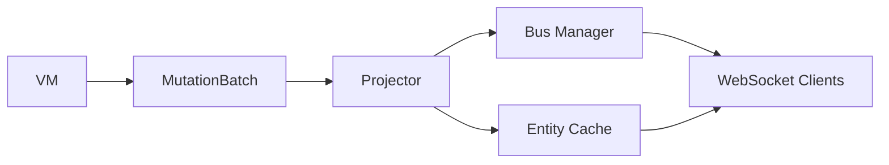

The projector receives mutations from the VM and routes them to WebSocket clients. It manages view subscriptions, entity caching, and frame delivery.

## Overview

The projector is the bridge between the VM and WebSocket clients.

**Location**: `projector.rs:17-278`

```rust
pub struct Projector {
    view_index: Arc<ViewIndex>,
    bus_manager: BusManager,
    entity_cache: EntityCache,
    mutations_rx: mpsc::Receiver<MutationBatch>,
    #[cfg(feature = "otel")]
    metrics: Option<Arc<Metrics>>,
}
```

## Data Flow



1. **VM** - Generates mutations via `EmitMutation` opcode
2. **MutationBatch** - Sent via mpsc channel
3. **Projector** - Routes to views
4. **Entity Cache** - Updates cached state
5. **Bus Manager** - Publishes frames
6. **Clients** - Receive updates

## MutationBatch

Batches of mutations from a single event.

**Location**: `mutation_batch.rs`

```rust
pub struct MutationBatch {
    pub mutations: Vec<Mutation>,
    pub slot_context: Option<SlotContext>,
    pub event_context: Option<EventContext>,
    pub span: tracing::Span,
}

pub struct Mutation {
    pub export: String,      // Entity name (e.g., "Token")
    pub key: Value,          // Primary key
    pub patch: Value,        // Partial state update
    pub append: Vec<String>, // Append-only field paths
}
```

### SlotContext

```rust
pub struct SlotContext {
    pub slot: u64,
    pub write_version: u64,
}

impl SlotContext {
    pub fn to_seq_string(&self) -> String {
        // Format: "<slot>:<write_version>"
        // Used for _seq field in entities for recency sorting
        format!("{}:{}", self.slot, self.write_version)
    }
}
```

### EventContext

```rust
pub struct EventContext {
    pub program: String,
    pub event_kind: String,
    pub event_type: String,
    pub account: String,
    pub accounts_count: usize,
}
```

## Processing Pipeline

The projector processes batches in a tight loop.

**Location**: `projector.rs:59-117`

```rust
pub async fn run(mut self) {
    while let Some(batch) = self.mutations_rx.recv().await {
        let _span_guard = batch.span.enter();
        
        let mut log = CanonicalLog::new();
        log.set("phase", "projector");
        
        let batch_size = batch.len();
        let slot_context = batch.slot_context;
        let mut frames_published = 0;
        let mut errors = 0;
        
        // Log event context
        if let Some(ctx) = batch.event_context.as_ref() {
            log.set("program", &ctx.program)
                .set("event_kind", &ctx.event_kind)
                .set("event_type", &ctx.event_type)
                .set("account", &ctx.account)
                .set("accounts_count", ctx.accounts_count);
        }
        
        // Process each mutation
        for mutation in batch.mutations {
            match self.process_mutation(mutation, slot_context, &mut json_buffer).await {
                Ok(count) => frames_published += count,
                Err(e) => {
                    error!("Failed to process mutation: {}", e);
                    errors += 1;
                }
            }
            
            #[cfg(feature = "otel")]
            if let Some(ref metrics) = self.metrics {
                metrics.record_mutation_processed(&export);
            }
        }
        
        log.set("batch_size", batch_size)
            .set("frames_published", frames_published)
            .set("errors", errors);
        
        log.emit();
    }
}
```

## Mutation Processing

**Location**: `projector.rs:119-212`

```rust
async fn process_mutation(
    &self,
    mutation: Mutation,
    slot_context: Option<SlotContext>,
    json_buffer: &mut Vec<u8>,
) -> Result<u32> {
    // 1. Find view specs for this entity
    let specs = self.view_index.by_export(&mutation.export);
    if specs.is_empty() {
        return Ok(0);
    }
    
    // 2. Extract key as string
    let key = Self::extract_key(&mutation.key);
    let mut patch = mutation.patch;
    
    // 3. Inject _seq for recency sorting
    if let Some(ctx) = slot_context {
        if let Value::Object(ref mut map) = patch {
            map.insert("_seq".to_string(), Value::String(ctx.to_seq_string()));
        }
    }
    
    // 4. Filter specs by key pattern
    let matching_specs: SmallVec<[&ViewSpec; 4]> = specs
        .iter()
        .filter(|spec| spec.filters.matches(&key))
        .collect();
    
    if matching_specs.is_empty() {
        return Ok(0);
    }
    
    let mut frames_published = 0;
    
    // 5. Process each matching view
    for (i, spec) in matching_specs.into_iter().enumerate() {
        let is_last = i == match_count - 1;
        
        // Reuse patch for last spec, clone for others
        let patch_data = if is_last {
            std::mem::take(&mut patch)
        } else {
            patch.clone()
        };
        
        // 6. Apply projection (field selection)
        let projected = spec.projection.apply(patch_data);
        
        // 7. Create frame
        let frame = Frame {
            mode: spec.mode,
            export: spec.id.clone(),
            op: "patch",
            key: key.clone(),
            data: projected,
            append: mutation.append.clone(),
        };
        
        // 8. Serialize frame
        json_buffer.clear();
        serde_json::to_writer(&mut *json_buffer, &frame)?;
        let payload = Arc::new(Bytes::copy_from_slice(json_buffer));
        
        // 9. Update entity cache
        self.entity_cache
            .upsert_with_append(&spec.id, &key, frame.data.clone(), &frame.append)
            .await;
        
        // 10. Update derived view caches
        if spec.mode == Mode::List {
            self.update_derived_view_caches(&spec.id, &key).await;
        }
        
        // 11. Publish frame to bus
        let message = Arc::new(BusMessage {
            key: key.clone(),
            entity: spec.id.clone(),
            payload,
        });
        
        self.publish_frame(spec, message).await;
        frames_published += 1;
        
        #[cfg(feature = "otel")]
        if let Some(ref metrics) = self.metrics {
            let mode_str = match spec.mode {
                Mode::List => "list",
                Mode::State => "state",
                Mode::Append => "append",
            };
            metrics.record_frame_published(mode_str, &spec.export);
        }
    }
    
    Ok(frames_published)
}
```

## Key Extraction

Convert various key types to strings.

**Location**: `projector.rs:214-233`

```rust
fn extract_key(key: &Value) -> String {
    key.as_str()
        .map(|s| s.to_string())
        // Handle numeric keys
        .or_else(|| key.as_u64().map(|n| n.to_string()))
        .or_else(|| key.as_i64().map(|n| n.to_string()))
        // Handle byte array keys (hex encode)
        .or_else(|| {
            key.as_array().and_then(|arr| {
                let bytes: Vec<u8> = arr
                    .iter()
                    .filter_map(|v| v.as_u64().map(|n| n as u8))
                    .collect();
                if bytes.len() == arr.len() {
                    Some(hex::encode(&bytes))
                } else {
                    None
                }
            })
        })
        // Fallback to JSON string
        .unwrap_or_else(|| key.to_string())
}
```

**Examples**:
- `"abc"` → `"abc"`
- `123` → `"123"`
- `[1, 2, 3]` → `"010203"`
- `{"foo": "bar"}` → `"{\"foo\":\"bar\"}"`

## Derived View Updates

When a source view is updated, derived views are notified.

**Location**: `projector.rs:235-258`

```rust
async fn update_derived_view_caches(&self, source_view_id: &str, entity_key: &str) {
    // Find derived views that depend on this source
    let derived_views = self.view_index.get_derived_views_for_source(source_view_id);
    if derived_views.is_empty() {
        return;
    }
    
    // Get updated entity data
    let entity_data = match self.entity_cache.get(source_view_id, entity_key).await {
        Some(data) => data,
        None => return,
    };
    
    // Update sorted caches for each derived view
    let sorted_caches = self.view_index.sorted_caches();
    let mut caches = sorted_caches.write().await;
    
    for derived_spec in derived_views {
        if let Some(cache) = caches.get_mut(&derived_spec.id) {
            cache.upsert(entity_key.to_string(), entity_data.clone());
            debug!(
                "Updated sorted cache for derived view {} with key {}",
                derived_spec.id, entity_key
            );
        }
    }
}
```

## Frame Publishing

Publish frames to appropriate buses based on mode.

**Location**: `projector.rs:260-277`

```rust
async fn publish_frame(&self, spec: &ViewSpec, message: Arc<BusMessage>) {
    match spec.mode {
        Mode::State => {
            // Publish to entity-specific state bus
            self.bus_manager
                .publish_state(&spec.id, &message.key, message.payload.clone())
                .await;
        }
        Mode::List | Mode::Append => {
            // Publish to view-wide list bus
            self.bus_manager.publish_list(&spec.id, message).await;
        }
    }
}
```

## ViewIndex

The view index manages view specifications and routing.

**Location**: `view/mod.rs`

```rust
pub struct ViewIndex {
    specs_by_id: HashMap<String, ViewSpec>,
    specs_by_export: HashMap<String, Vec<Arc<ViewSpec>>>,
    derived_view_sources: HashMap<String, Vec<Arc<ViewSpec>>>,
    sorted_caches: Arc<RwLock<HashMap<String, SortedCache>>>,
}

impl ViewIndex {
    // Get view by ID (e.g., "Token/list")
    pub fn get_view(&self, id: &str) -> Option<&ViewSpec>;
    
    // Get all views for an entity (e.g., "Token")
    pub fn by_export(&self, export: &str) -> Vec<Arc<ViewSpec>>;
    
    // Get derived views that depend on a source view
    pub fn get_derived_views_for_source(&self, source_id: &str) -> Vec<Arc<ViewSpec>>;
}
```

### ViewSpec

```rust
pub struct ViewSpec {
    pub id: String,              // "Token/list"
    pub export: String,          // "Token"
    pub mode: Mode,              // List, State, Append
    pub projection: Projection,  // Field selection
    pub filters: Filters,        // Key pattern matching
    pub delivery: Delivery,      // Snapshot config
    pub pipeline: Option<Pipeline>, // View transforms
    pub source_view: Option<String>, // For derived views
}
```

### Projection

Selects which fields to include:

```rust
pub enum Projection {
    All,                          // Include all fields
    Fields(HashSet<String>),      // Include specific fields
    Exclude(HashSet<String>),     // Exclude specific fields
}

impl Projection {
    pub fn apply(&self, value: Value) -> Value {
        match self {
            Projection::All => value,
            Projection::Fields(fields) => {
                // Filter to included fields only
            }
            Projection::Exclude(fields) => {
                // Remove excluded fields
            }
        }
    }
}
```

### Filters

Match keys by pattern:

```rust
pub enum Filters {
    All,                          // Match all keys
    Keys(HashSet<String>),        // Match specific keys
    Pattern(String),              // Match regex pattern
}

impl Filters {
    pub fn matches(&self, key: &str) -> bool {
        match self {
            Filters::All => true,
            Filters::Keys(keys) => keys.contains(key),
            Filters::Pattern(pattern) => {
                // Regex matching
            }
        }
    }
}
```

## Entity Cache

The entity cache stores current state for snapshot delivery.

**Location**: `cache.rs`

```rust
pub struct EntityCache {
    cache: Arc<RwLock<HashMap<String, ViewCache>>>,
    config: EntityCacheConfig,
}

struct ViewCache {
    entities: LruCache<String, Value>,
}
```

### Operations

**Upsert**:
```rust
pub async fn upsert(&self, view_id: &str, key: &str, data: Value) {
    let mut cache = self.cache.write().await;
    let view_cache = cache
        .entry(view_id.to_string())
        .or_insert_with(|| ViewCache::new(self.config.max_entities_per_view));
    
    view_cache.entities.put(key.to_string(), data);
}
```

**Get**:
```rust
pub async fn get(&self, view_id: &str, key: &str) -> Option<Value> {
    let cache = self.cache.read().await;
    cache
        .get(view_id)
        .and_then(|vc| vc.entities.peek(key).cloned())
}
```

**Get All**:
```rust
pub async fn get_all(&self, view_id: &str) -> Vec<(String, Value)> {
    let cache = self.cache.read().await;
    cache
        .get(view_id)
        .map(|vc| {
            vc.entities
                .iter()
                .map(|(k, v)| (k.clone(), v.clone()))
                .collect()
        })
        .unwrap_or_default()
}
```

## Performance Characteristics

### Throughput

**Bottlenecks**:
1. JSON serialization (CPU-bound)
2. Entity cache updates (lock contention)
3. Bus publishing (channel saturation)

**Optimizations**:
- Reuse JSON buffer to avoid allocations
- Clone patch only when needed (last spec reuses)
- Use SmallVec for hot path allocations

### Latency

Typical mutation processing time:
- **p50**: 0.5-1ms
- **p99**: 2-5ms
- **p99.9**: 10-20ms

With `otel` feature, metrics are exported:

```rust
metrics.record_projector_latency(log.duration_ms());
```

## Error Handling

The projector handles errors gracefully:

```rust
match self.process_mutation(mutation, ...).await {
    Ok(count) => frames_published += count,
    Err(e) => {
        error!("Failed to process mutation: {}", e);
        errors += 1;
        // Continue processing other mutations
    }
}
```

**Common Errors**:
- JSON serialization failure
- Invalid view ID
- Cache update failure
- Bus publish failure (full channel)

## Monitoring

Key metrics to monitor:

- `mutations_processed_total{entity}` - Total mutations processed
- `frames_published_total{mode,entity}` - Frames published per mode
- `projector_latency_seconds` - Processing latency histogram
- `projector_errors_total` - Error count

See [Monitoring](/server/monitoring) for detailed metrics setup.

## Next Steps

<CardGroup cols={2}>
  <Card title="WebSocket Protocol" icon="plug" href="/server/websocket-protocol">
    Understand frame delivery
  </Card>
  <Card title="Virtual Machine" icon="microchip" href="/server/vm">
    Learn about the VM
  </Card>
  <Card title="Architecture" icon="sitemap" href="/server/architecture">
    See the big picture
  </Card>
  <Card title="Monitoring" icon="chart-line" href="/server/monitoring">
    Monitor projector performance
  </Card>
</CardGroup>
